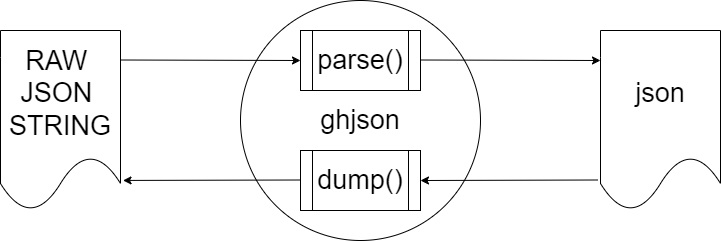

# 从一开始搭建json库教程（零）

## 面向真正的新手，从我自己足够菜鸟的角度出发。

当我想用C++做一些自己的项目的时候，搜出来比较简单的项目之中就有JSON库。中文教程中比较多人推荐的应该就是叶劲峰老师的[从零开始的 JSON 库教程](https://zhuanlan.zhihu.com/p/22457315)，老师写得很好，也在每个章节设置了该完成的任务，跟打游戏一样。但对于真正的新手而言，我指像我这样真的很菜的菜鸟，我觉得不够清晰，也不够全面。而且有一个点，我想用C++写。

然后，我在github找到一套使用C++11标准的库[json11](https://github.com/dropbox/json11)，恰巧我刚好在读《深入理解C++11》（前年就买了，一直没读完，希望这次能一口气研究完，就我一个菜鸟的四年工作经验而言，C++11都还没真正普及在工作使用）

在研究了一段时间之后，我觉得我可以写一个更详细的使用C++11搭建JSON库的中文教程，我做的这些工作都是站在巨人的肩膀上的一些微小的工作，所以我才把这个教程叫做从**从一开始搭建json库教程**。

写教程的另外一个目的是我了解到最好的学习方法是寓教于学，因为能把项目面向一个真的新手讲清楚，就证明肯定也能面向面试官讲清楚。推荐大家将自己学习的经验写下来，会有助于自己的理解，在这同时能帮到真的需要帮助的朋友那就更好了。如果大佬们有空有幸读到本教程，看出有什么疏漏错误的话，希望在评论区指出，虽然我觉得大佬也不会花时间看这种教程。

我们的 JSON 库名为 ghjson，因为greenhand就有菜鸟的意思。

## 当我们在谈论json库的时候，我们在谈论什么？

### 什么是json？

JSON格式是1999年《JavaScript Programming Language, Standard ECMA-262 3rd Edition》的子集合，所以可以在JavaScript以eval()函数（javascript通过eval()调用解析器）读入。不过这并不代表JSON无法使用于其他语言，事实上几乎所有与网络开发相关的语言都有JSON函式库。

JSON 的基本数据类型：

数值：十进制数，不能有前导0，可以为负数，可以有小数部分。还可以用e或者E表示指数部分。不能包含非数，如NaN。不区分整数与浮点数。JavaScript用双精度浮点数表示所有数值。

示例：
~~~
30
~~~
字符串：以双引号""括起来的零个或多个Unicode码位。支持反斜杠开始的转义字符序列。

示例：
~~~
"Jane Doe"
~~~
布尔值：表示为true或者false。

示例：
~~~
true
~~~
数组：有序的零个或者多个值。每个值可以为任意类型。数组使用方括号[]包裹。多个数组元素之间用逗号,分隔，形如：[value, value]。

示例：
~~~
["Bob", "Alice", "John"]
~~~
对象：若干无序的“键-值对”(key-value pairs)，其中键只能是字符串[2]。建议但不强制要求对象中的键是独一无二的。对象以花括号{}包裹。多个键-值对之间使用逗号,分隔。键与值之间用冒号:分隔。

示例：
~~~
{
  "name": "Jane Doe",
  "age": 30,
  "address": {
    "street": "123 Main St",
    "city": "Anytown",
    "zipcode": "12345"
  }
}
~~~
空值：值写为null

示例：
~~~
null
~~~

### json库需要做什么？

一个json库的最基础功能是两个：

1、解析：将 JSON 格式的字符串解析为相应的数据结构，如对象、数组、字符串、数字等。

2、序列化：将程序中的数据结构转换为 JSON 格式的字符串。

我们的 JSON 库名为**ghjson**。JSON格式的字符串我们用**RAW JSON STRING**表示，程序中的数据结构我们用**json**来表示，解析功能我们使用**parse**接口提供，序列化功能我们使用**dump**接口提供。这些名称我都是随自己习惯命名，没有明确要求。

## 启程

现在，我们已经对 JSON 的基本概念有了一定的了解，并且明确了我们要建立的 JSON 库的基本结构。接下来，让我们深入探讨如何构建 JSON 数据结构，并且编写解析和序列化接口，以便我们能够在程序中方便地使用 JSON 数据。

在接下来的章节中，我们将依次完成以下任务：

1、**构建 JSON 数据结构**：我们将学习如何设计和表示 JSON 数据结构，包括对象、数组等。我们将深入了解 JSON 数据结构的基本构成，以及如何在 C++ 中表示它们。

2、**搭建 parse() 接口**：我们将编写解析函数，负责将 JSON 格式的字符串转换为程序内部的 JSON 数据结构。我们将学习如何识别和处理 JSON 字符串中的各个部分，以及如何构建相应的数据结构。

3、**搭建 dump() 接口**：最后，我们将编写序列化函数，负责将程序内部的 JSON 数据结构转换为 JSON 格式的字符串。我们将学习如何遍历 JSON 数据结构，并将其转换为字符串表示形式。

在这些章节中，我们将逐步构建一个简单但功能强大的 JSON 库，帮助你更好地理解和使用 JSON 数据。让我们开始吧！